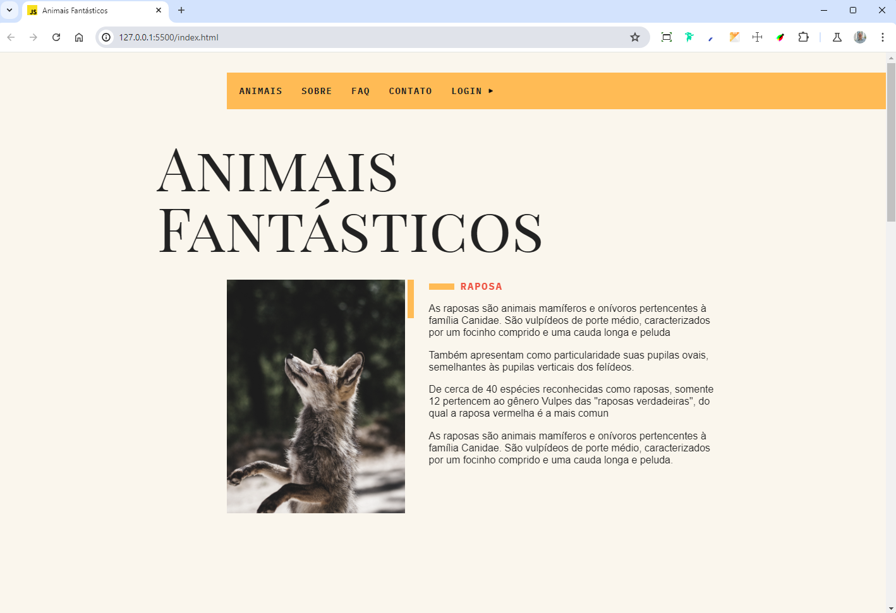

<!-- Titulo do Projeto -->

# ✨Animais Fantásticos - JavaScript ES6


## Table of Contents

- [Project description](#project-description)
- [Setup](#setup)
  - [Pre-requisites](#prerequisites)
  - [technologies and tools](#technologies-and-tools)
- [Instalation](#installation)
- [Usage](#usage)
- [References](#references)
- [Contributors or owners](#contributors-or-owners)
- [Contact](#contact)
- [License](#license)

## Project Description

Esse Projeto faz parte do curso de JavaScript ES6 Completo da [Origamid](https://www.origamid.com). É um site que descreve as características de 06 animais Fantásticos durante o curso foi abordado alguns dos assuntos como:<br>
`Variáveis` `Tipos de Dados` `Funções` `Escopo` `Objetos` `Efeitos no Dom` `JavaScript Assíncrono` `Promises` `Fetch` `Classes` `Rest e Spread` `Destructuring` `Async&Await` `Regular Expression` `entre outros assuntos` </br>
Também foram abordados temas como **Git**, **Automação de processos**, **Webpack e Babel**

`Task`

- Desenvolver o Projeto do Zero, criando elementos de animação praticando a Linguagem **JavaScript**

`Challenge`

Os Maiores desafios foram:<br>
Colocar em pratica o que foi aprendido no curso, criando animações, sem nenhum uso de plugin externo:

- [x] **Navegação por Tabs**
- [x] **Accordion List**
- [x] **Scroll Suave**
- [x] **Animação ao Fazer o Scroll**
- [x] **Modal**
- [x] **Dropdown Menu**
- [x] **Menu Mobile**
- [x] **Tooltips**
- [x] **Animação de Números**
- [x] **Fetch API com 02 API's distintas**
- [x] **Criação de Carrousel de Imagens**

> [!Tip]
> Caso queira ver como ficou siga os passos abaixo.

<!-- Menu -->

<!-- Setup do Projeto -->

## Setup

Requisitos necessários para rodar o projeto:<br>

### Prerequisites

>

`Node.js` `VSCode` `Git` `Live Server`

> [!Important]
>
> - Run Time [Node.js](https://nodejs.org/en/) com a versão _16 ou superior_.<br>
> - Um editor de códigos onde eu recomendo o [VCode](https://code.visualstudio.com/)<br>
> - E o [git](https://git-scm.com/downloads) uma aplicação de versionamento de código.
> - Extensão do VSCode [**Live Server**](https://marketplace.visualstudio.com/items?itemName=ritwickdey.LiveServer)

### technologies and tools

`Webpack` `Babel` `ESLint` `Git`

## Installation

Para rodar o projeto em seu computador você tera que fazer o [fork](https://docs.github.com/pt/pull-requests/collaborating-with-pull-requests/working-with-forks/fork-a-repo) do repositório. Caso você não saiba como fazer, estou deixando um **link** da documentação oficial do gitHub, onde é esclarecido como fazer esse processo.<br> Fazendo esse processo você tera uma copia desse Repositório no seu GitHub.
<br>

<a href="https://docs.github.com/pt/pull-requests/collaborating-with-pull-requests/working-with-forks/fork-a-repo"></a>

Depois de ter feito o **fork** vamos fazer o [clone](https://docs.github.com/pt/repositories/creating-and-managing-repositories/cloning-a-repository) desse Repositório através do **VSCode**. </br>
Caso você não saiba como fazer, estou deixando um link para a documentação oficial do gitHub onde é esclarecido como fazer esse processo.
<br>
<sub>Command Line</sub>

```bash
git clone https://github.com/PedroAntonny/Animais-Fantasticos
```


<a href="https://docs.github.com/pt/repositories/creating-and-managing-repositories/cloning-a-repository"></a>

Dentro do nosso **VSCode** vamos abrir o nosso **terminal**. Temos que baixar as dependências do Projeto para o nosso computador para que ele consiga ser Executado:

**1. Instalando as dependências**<br>

 <details open>

<summary>Gerenciador de pacotes usado</summary>

**npm**

</details>

<sub>Command Line</sub>

```npm
npm install
```

## Usage

**2. Inicie o processo de compilação do JavaScript com o seguinte comando dentro do Terminal**<br>
<sub>Command Line</sub>

```npm
npm run dev
```

<br>

**3 Iniciar o LiveServer clicando com o botão Direito do Mouse no arquivo `index.html` em `Open with Live Server`**

 <!-- Imagem de Demostração -->
<h3 align="center"> Imagem de demostração do Projeto

</br>
</br>


</h3>

 <div align="center">
Acesse a versão on-line Projeto clicando no Link Abaixo
<a href="https://pedroantonny.github.io/Animais-Fantasticos/">Clique aqui!<a/>
</div>
<br>

## References

**Acesse:** [Origamid](https://origamid.com/)

## Contributors or owners

Designed by Origamid and developed by [Pedro Antonny](https://github.com/PedroAntonny)<br>
&copy; Todos os Direitos Reservados

## License

<br>
Released in 2024 This project is under the **MIT license**<br>
<br>
<br>

[`voltar ao topo`](#-portfólio-github)
